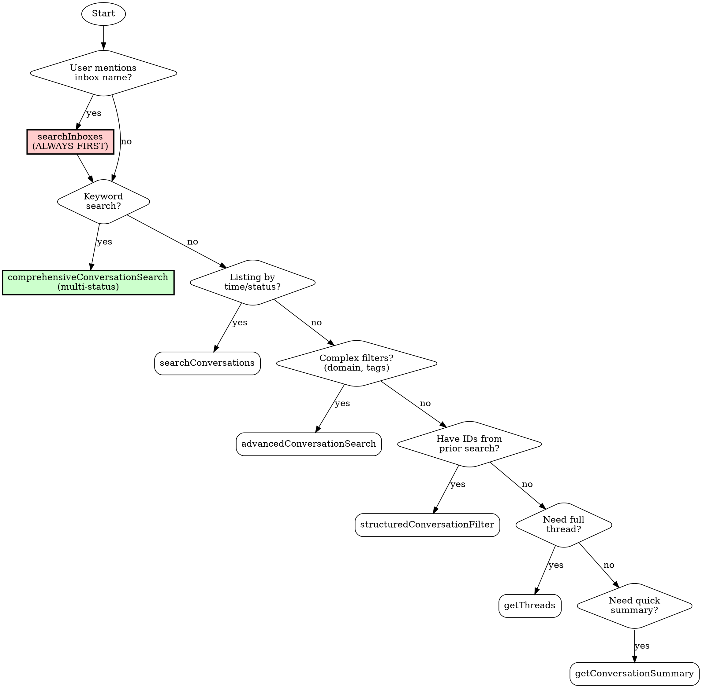

# HelpScout Navigation

Guide for correctly using HelpScout MCP tools. Prevents common mistakes and ensures complete search results.

## First Step: Verify MCP Connection

**Check if HelpScout MCP tools are available.** Look for these tools:
- `mcp__helpscout__searchInboxes`
- `mcp__helpscout__searchConversations`
- `mcp__helpscout__comprehensiveConversationSearch`

**If HelpScout tools are available:** Skip to "Critical Rules" section.

**If HelpScout tools are NOT available:** The MCP server needs credentials. Tell the user:

> "HelpScout MCP tools are not available. This usually means credentials aren't configured.
>
> **To set up HelpScout credentials:**
>
> 1. Get your credentials from HelpScout:
>    - Go to HelpScout → Your Profile → My Apps
>    - Create a new app (or use existing)
>    - Copy the **App ID** and **App Secret**
>
> 2. Add to your shell profile (`~/.zshrc` or `~/.bashrc`):
>    ```bash
>    export HELPSCOUT_APP_ID="your-app-id-here"
>    export HELPSCOUT_APP_SECRET="your-app-secret-here"
>    ```
>
> 3. Restart your terminal and Claude Code
>
> After restart, the HelpScout MCP will start automatically."

**Do not proceed with HelpScout operations until the MCP tools are available.**

---

## Overview

The HelpScout MCP server provides 9 tools for searching and retrieving support conversations. However, using them incorrectly leads to missed tickets and incomplete results. This skill ensures you use the right tool in the right order.

**Core problems this skill solves:**
1. Users forget to call `searchInboxes` first (required for inbox-scoped searches)
2. `searchConversations` defaults to "active" status only (misses closed/pending)
3. Users don't know which search tool to use for their query type

---

## Critical Rules (MUST READ FIRST)

### Rule 1: ALWAYS Call searchInboxes First

**When a user mentions an inbox by name, you MUST look up the inbox ID before searching.**

| User Says | You MUST Do First |
|-----------|-------------------|
| "Search the support inbox" | `searchInboxes(query: "support")` |
| "Find tickets in sales mailbox" | `searchInboxes(query: "sales")` |
| "Check the billing inbox" | `searchInboxes(query: "billing")` |

**Why:** All inbox-scoped searches require an inbox ID (numeric), not a name.

### Rule 2: searchConversations Defaults to "Active" Only

**DANGER:** `searchConversations` without a status parameter only returns active tickets.

| What You Want | WRONG Tool | RIGHT Tool |
|---------------|------------|------------|
| "Find tickets about billing" | `searchConversations(query: "billing")` | `comprehensiveConversationSearch(searchTerms: ["billing"])` |
| "Search for refund requests" | `searchConversations(query: "refund")` | `comprehensiveConversationSearch(searchTerms: ["refund"])` |

**Use `searchConversations` ONLY when:**
- Listing recent tickets (no keyword search)
- You explicitly want only active tickets
- Combined with explicit status parameter

**Use `comprehensiveConversationSearch` when:**
- Searching by keywords
- You want to find tickets regardless of status
- Default behavior (searches active + pending + closed)

### Rule 3: structuredConversationFilter is for AFTER Discovery

**This tool requires IDs from previous searches. Do NOT use for initial searches.**

| Use Case | Correct Approach |
|----------|------------------|
| Find ticket #42839 | `structuredConversationFilter(conversationNumber: 42839)` |
| Find John's assigned tickets | First: get John's ID. Then: `structuredConversationFilter(assignedTo: <johnId>)` |
| Find customer 12345's history | `structuredConversationFilter(customerIds: [12345])` |

---

## Decision Tree: Which Tool to Use



### Quick Decision Matrix

| I want to... | Use this tool | Required first? |
|--------------|---------------|-----------------|
| Search by keywords | `comprehensiveConversationSearch` | `searchInboxes` if inbox mentioned |
| List recent tickets | `searchConversations` | `searchInboxes` if inbox mentioned |
| Find tickets by email domain | `advancedConversationSearch` | `searchInboxes` if inbox mentioned |
| Look up ticket #12345 | `structuredConversationFilter` | None |
| Get all tickets from customer X | `structuredConversationFilter` | Need customer ID from prior search |
| Read full conversation | `getThreads` | Need conversation ID |
| Get quick overview | `getConversationSummary` | Need conversation ID |
| List all inboxes | `listAllInboxes` | None |
| Get current server time | `getServerTime` | None |

---

## Tool Reference Summary

| Tool | Purpose | Key Limitation |
|------|---------|----------------|
| `searchInboxes` | Get inbox ID from name | ALWAYS call first when inbox mentioned |
| `listAllInboxes` | List all available inboxes | Helper for discovery |
| `searchConversations` | List tickets by time/status | **Defaults to ACTIVE ONLY** |
| `comprehensiveConversationSearch` | Keyword search across statuses | Preferred for content search |
| `advancedConversationSearch` | Complex filters (domain, tags) | For boolean logic |
| `structuredConversationFilter` | ID-based lookup | Requires IDs from prior search |
| `getConversationSummary` | Quick overview | Needs conversation ID |
| `getThreads` | Full message history | Needs conversation ID |
| `getServerTime` | Current timestamp | For time-relative searches |

See [references/tool-reference.md](references/tool-reference.md) for complete parameter documentation.

---

## Common Workflows

### Workflow 1: Search Inbox X for Keyword Y

**User:** "Search the support inbox for billing issues"

**Steps:**
1. Look up inbox ID:
   ```
   searchInboxes(query: "support")
   ```
   Result: `{ id: 359402, name: "Support" }`

2. Search with inbox scope:
   ```
   comprehensiveConversationSearch(
     searchTerms: ["billing"],
     inboxId: "359402"
   )
   ```

### Workflow 2: Show Recent Tickets in Inbox X

**User:** "Show me recent tickets in the sales inbox"

**Steps:**
1. Look up inbox ID:
   ```
   searchInboxes(query: "sales")
   ```

2. List recent (no keyword = use searchConversations):
   ```
   searchConversations(
     inboxId: "359402",
     sort: "createdAt",
     order: "desc",
     limit: 20
   )
   ```

### Workflow 3: Find Ticket #12345

**User:** "Show me ticket 12345"

**Steps:**
1. Direct lookup (no inbox lookup needed):
   ```
   structuredConversationFilter(conversationNumber: 12345)
   ```

2. Get details:
   ```
   getConversationSummary(conversationId: "<id from step 1>")
   ```

### Workflow 4: Find All Tickets from Domain

**User:** "Find tickets from @acme.com"

**Steps:**
1. Use advanced search with domain filter:
   ```
   advancedConversationSearch(emailDomain: "acme.com")
   ```

### Workflow 5: Get Full Conversation Thread

**User:** "Show me the full thread for conversation 12345678"

**Steps:**
1. Get all messages:
   ```
   getThreads(conversationId: "12345678", limit: 200)
   ```

---

## Anti-Patterns (What NOT to Do)

| Mistake | Why It Fails | Correct Approach |
|---------|--------------|------------------|
| `searchConversations(query: "billing")` without status | Returns active only, misses 80%+ of tickets | `comprehensiveConversationSearch(searchTerms: ["billing"])` |
| `searchConversations(inboxId: "Support")` | Inbox ID must be numeric, not name | First: `searchInboxes(query: "Support")` |
| `structuredConversationFilter` as first search | Requires IDs you don't have yet | Start with `comprehensiveConversationSearch` |
| Skipping `searchInboxes` when user mentions inbox | API requires numeric inbox ID | ALWAYS lookup first |
| Using `searchConversations` for keyword search | Misses closed/pending tickets | Use `comprehensiveConversationSearch` |

See [references/common-mistakes.md](references/common-mistakes.md) for more anti-patterns.

---

## Quick Reference Card

```bash
# STEP 1: Always get inbox ID first (when inbox mentioned)
searchInboxes(query: "support")  # Returns inbox ID

# STEP 2a: Keyword search (multi-status)
comprehensiveConversationSearch(
  searchTerms: ["billing", "refund"],
  inboxId: "359402",
  timeframeDays: 60
)

# STEP 2b: List recent (no keywords)
searchConversations(
  inboxId: "359402",
  sort: "createdAt",
  order: "desc"
)

# Direct ticket lookup
structuredConversationFilter(conversationNumber: 12345)

# Email domain search
advancedConversationSearch(emailDomain: "acme.com")

# Full thread
getThreads(conversationId: "12345678")

# Quick summary
getConversationSummary(conversationId: "12345678")
```

---

## Common Mistakes Checklist

Before executing a HelpScout search, verify:

- [ ] Did user mention an inbox name? → Called `searchInboxes` first?
- [ ] Searching by keywords? → Using `comprehensiveConversationSearch` (not `searchConversations`)?
- [ ] Need closed/pending tickets? → NOT using bare `searchConversations`?
- [ ] Using inbox ID, not inbox name, in API calls?
- [ ] Using `structuredConversationFilter` only with IDs from prior searches?
