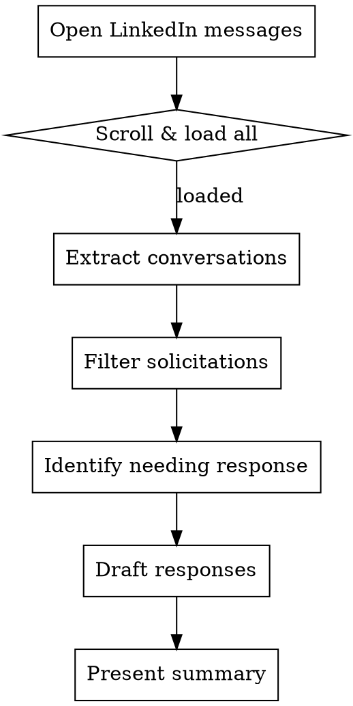

# LinkedIn Message Triage

## Overview

Systematic process for reviewing LinkedIn inbox, separating real connections from noise, and drafting context-appropriate responses based on current career status.

## REQUIRED: Browser Automation Setup

**This skill requires browser automation to access LinkedIn. You MUST verify this before proceeding.**

### Step 1: Check for Playwright MCP

Look for these tools in your available tools:
- `mcp__playwright__browser_navigate` or `mcp__plugin_playwright_playwright__browser_navigate`
- `mcp__playwright__browser_snapshot`

**If Playwright tools are available:** Proceed to "When to Use" section.

**If Playwright tools are NOT available:** Ask the user:

> "LinkedIn message triage requires browser automation to access your inbox. I don't see Playwright MCP available. Would you like me to help you set it up?
>
> **Options:**
> 1. **Install Playwright MCP** - I can guide you through setup
> 2. **Skip for now** - We can't proceed without browser access
>
> Note: You'll need to log into LinkedIn in the browser window that opens."

### Step 2: Playwright MCP Setup (if needed)

If user wants to install Playwright MCP:

```bash
# Check if Playwright MCP is in the catalog
claude mcp add playwright

# Or add manually to Claude Code settings
```

Add to `~/.claude/settings.json` under `mcpServers`:
```json
{
  "mcpServers": {
    "playwright": {
      "command": "npx",
      "args": ["@anthropic/mcp-playwright"]
    }
  }
}
```

Then restart Claude Code.

### Step 3: LinkedIn Login

Once Playwright is available:
1. Navigate to LinkedIn: `browser_navigate` to `https://www.linkedin.com/login`
2. **Tell the user:** "Please log into LinkedIn in the browser window. Let me know when you're logged in."
3. Wait for user confirmation before proceeding
4. Verify login by checking for messaging elements

**Do NOT proceed until:**
- [ ] Playwright MCP is confirmed available
- [ ] User has logged into LinkedIn
- [ ] You can access the messaging page

---

## When to Use

**Use this skill when:**
- User asks to review/check/triage LinkedIn messages
- Need to identify which messages require responses
- Drafting responses to LinkedIn connections
- Catching up on delayed message responses

**Skip for:**
- Single specific message ("respond to John")
- Already know which messages need responses

## Core Pattern



## First Step: Establish Current Date

**Before analyzing messages, get today's date.** This is critical for:
- Determining if messages are "delayed" (>1 month old)
- Calculating response priority
- Checking if context file date references are stale

```bash
date "+%Y-%m-%d"
```

Record it: `Triage date: [today's date]`

**Do NOT assume the date.** Claude's training data defaults to outdated years.

## Quick Reference

### Message Categories

| Type | Indicators | Action |
|------|-----------|--------|
| **Real Connection** | Personal message, mutual history, specific question | Draft response |
| **InMail** | "InMail" badge, recruiting pitch | Skip |
| **Sponsored** | "Sponsored" label, product pitch | Skip |
| **Solicitation** | Investment pitch, sales cold outreach | Skip unless known contact |
| **Delayed Response** | Old message (>1 month), from real contact | Acknowledge delay, update |

### Response Template Pattern

For real connections needing updates:

```
1. Acknowledge (if delayed: apologize briefly)
2. Share career update (from your context file)
3. Current focus (tailored to relationship level)
4. Invitation to connect (if relevant to their domain)
5. Simple call-to-action (prefer in-person per your preferences)
```

## Implementation

### Step 1: Navigate and Load

```javascript
// Navigate to LinkedIn messaging
await page.goto('https://www.linkedin.com/messaging/');
await page.waitForTimeout(3000);

// Scroll to load more conversations
const list = await page.$('[aria-label="Conversation List"]');
for (let i = 0; i < 5; i++) {
  await list.evaluate(el => el.scrollBy(0, 1000));
  await page.waitForTimeout(500);
}
```

### Step 2: Extract Visible Conversations

Look for:
- Name (h3 heading)
- Last message preview
- Timestamp
- InMail/Sponsored badges

### Step 3: Filter and Categorize

**Skip immediately:**
- Contains "InMail" in preview
- Contains "Sponsored" in name/preview
- Generic sales pitches ("I see you're in...", "Quick question about...")
- Real estate investments, recruiting cold calls

**Flag for review:**
- Personal names with actual message content
- References to shared history or mutual connections
- Specific questions or requests
- Former colleagues or industry contacts

### Step 4: Draft Responses

**For delayed responses (>1 month):**
```
Hey [Name]! I'm really sorry for [completely blowing you off/the super late response],
this [completely got buried/I should have responded months ago].

[Career update with full context if they're a friend/colleague]

Would love to [catch up/reconnect] [in the next few weeks]. You free for a call?
```

**For recent messages:**
```
Hey [Name]! [Acknowledge their message specifically].

[Brief career update appropriate to relationship]

[Specific response to their question/invitation]

Looking forward to [staying in touch/connecting]!
```

### Your Career Context

Import your personal context file:

@~/.claude/linkedin-context.md

**If file doesn't exist**, ask user to create it or provide:
- Current career status (employed, searching, transitioning, retired)
- Brief career narrative for close contacts vs. casual contacts
- Industry-specific talking points
- Meeting preferences

See template below for setup instructions.

### Context Maintenance (Self-Aware)

**During triage, watch for signals that context needs updating:**

| Signal | Example | Action |
|--------|---------|--------|
| **User corrects draft** | "No, I'm not looking for roles anymore" | Note the correction, suggest context update |
| **New information provided** | "Actually I started at [Company] last month" | Offer to add to context file |
| **Repeated corrections** | Same type of fix multiple times | Flag pattern, suggest adding to context |
| **Date staleness** | Context says "through April" but it's June | Prompt user to review temporal statements |
| **Missing category** | User explains how to handle a contact type | Suggest adding new industry section |
| **Frustration signals** | "These aren't right" / significant rewrites | Pause, ask what's changed |

**At end of each triage session, if any signals detected:**

```markdown
## Context Review Suggested

Based on this session, your context file may need updates:

### Detected Changes
- [What changed or was corrected]

### Suggested Updates
[Specific text to add/modify in ~/.claude/linkedin-context.md]

**Options:**
1. I can update the file directly
2. Copy the suggestions above and update manually
3. Skip for now (I'll remind you next session)
```

**Proactive staleness detection:**

Before starting triage, scan context file for:
- Date references that may be stale ("through April", "in Q1", "this spring")
- Temporal status words ("currently transitioning", "exploring", "figuring out")
- Time-bound statements that might have resolved

If found, ask:
> "Your context mentions [quote]. Is this still accurate, or should we update it?"

**Insight collection mode:**

If user says "add that to my context" or "remember this for next time":
1. Identify what insight to capture
2. Determine which section it belongs in
3. Append to `~/.claude/linkedin-context.md` with timestamp comment
4. Confirm the addition

```markdown
<!-- Added [DATE] based on triage session -->
### [New Section or Addition]
- [Captured insight]
```

## Communication Style Rules

**Always:**
- Use "Hey [Name]!" as opener
- Be direct and conversational
- Time-box expectations when relevant
- Reference shared context/history

**Never:**
- Use em-dashes (—)
- Be overly formal
- Generic networking speak
- Make it about you (flip to their work/interests)

**Common patterns:**
- "Would love to catch up" > "Let's connect sometime"
- "You free for a call?" > "Let me know if you'd like to chat"
- "Continuing my multi-year deep dive" > "Doing a deep dive"

## Common Mistakes

| Mistake | Fix |
|---------|-----|
| Responding to all InMails | Filter out recruiting cold calls |
| Missing unread badge | Check for notification indicators |
| Same template for everyone | Adjust depth based on relationship |
| Not acknowledging delay | If >1 month, brief apology upfront |
| Too much detail for casual contact | Use brief version for new connections |
| Missing shared context | Reference how you know them |

## Output Format

Present findings as:

```markdown
## NEEDS RESPONSE:

### 1. **Name** (Date) [UNREAD if applicable]
**Message:** [Preview]
**Type:** [Real connection type]
**Action needed:** [What to say]

---

## ALREADY HANDLED:
- ✅ Name (drafted/sent)

---

## SKIP (Solicitations):
- Name (Date) - [Reason]
```

## Real-World Impact

**Before this skill:**
- Manual scrolling through dozens of messages
- Missing real connections in noise
- Inconsistent response quality
- Delayed responses to important contacts

**After:**
- Systematic review in ~10 minutes
- Zero missed real connections
- Consistent, personal responses
- Clear action items per message

---

## Setup: Create Your Context File

Create `~/.claude/linkedin-context.md` with your personal information:

```markdown
# My LinkedIn Context

## Current Status
<!-- employed | searching | transitioning | building | retired -->
[Your current situation]

## Career Narrative

### Full Version (close contacts, industry peers)
> [Detailed narrative for people who know your background]

### Brief Version (casual contacts, new connections)
> [Shorter version for people you're just meeting]

## Industry-Specific Talking Points
<!-- Add sections for different audiences -->

### [Industry 1] Contacts
- [What to emphasize with this group]

### [Industry 2] Contacts
- [What to emphasize with this group]

## Meeting Preferences
- **Preferred:** In-person coffee, breakfast, or lunch
- **Location:** [Your city/area]
- **Virtual:** OK, especially for contacts outside [Your city/area]
- **Scheduling:** [Any preferences - e.g., "mornings work best"]

## Topics I Welcome
- [Topic 1]
- [Topic 2]

## Auto-Decline (Politely)
- [Type of outreach to decline]
- [Another type]
```

### Example: Professional/Business Background

```markdown
# My LinkedIn Context

## Current Status
Transitioning - exploring next chapter after 12 years in enterprise sales leadership

## Career Narrative

### Full Version (close contacts, industry peers)
> I stepped away from my SVP role at Acme Corp in October after leading the enterprise team
> through three years of 40%+ growth. Taking some time to figure out whether I want to do
> another operating role, advisory work, or potentially acquire a business. Enjoying the
> space to think strategically about the next 10 years.

### Brief Version (casual contacts, new connections)
> Recently transitioned from enterprise sales leadership at Acme Corp. Exploring advisory
> work and potential acquisitions while figuring out my next chapter.

## Industry-Specific Talking Points

### SaaS/Enterprise Sales Contacts
- Emphasize: Enterprise sales transformation, team scaling, M&A integration experience
- Reference: The post-acquisition integration playbook we built

### Private Equity/Search Fund Contacts
- Lead with: Interest in acquisition opportunities, operating experience
- Mention: Open to EIR or operating partner conversations

## Meeting Preferences
- **Preferred:** In-person coffee, breakfast, or lunch
- **Location:** Nashville area
- **Virtual:** OK, especially for contacts outside Nashville
- **Scheduling:** Flexible right now, mornings tend to work best

## Topics I Welcome
- Acquisition opportunities ($2-10M EBITDA range)
- Advisory/board roles at growth-stage companies
- Introductions to search funders or PE operating partners
- Catching up with former colleagues

## Auto-Decline (Politely)
- Recruiting for individual contributor sales roles
- MLM or "partnership" opportunities
- Generic "pick your brain" without specific context
```

### Example: Technical/Engineering Background

```markdown
# My LinkedIn Context

## Current Status
Building - left Big Tech to work on AI tooling full-time

## Career Narrative

### Full Version (close contacts, tech industry)
> After 8 years at [Company] leading the platform infrastructure team, I left in January
> to go deep on AI/ML tooling. Spent the last few months building developer tools and
> exploring whether to raise for a startup or join an early-stage company as a technical
> co-founder. Really enjoying the builder mode after years of management.

### Brief Version (casual contacts, new connections)
> Recently left [Company] to focus on AI developer tooling. Exploring the startup path
> while staying hands-on with code for the first time in years.

## Industry-Specific Talking Points

### Engineering/Tech Contacts
- Emphasize: Hands-on coding again, specific tech stack (Rust, Python, LLMs)
- Reference: Open source contributions, side projects

### VC/Startup Contacts
- Lead with: Problem space I'm exploring, early traction/prototypes
- Mention: Open to co-founder intros, not actively raising yet

### Former [Company] Colleagues
- Can be more candid about why I left
- Happy to help with references or intros

## Meeting Preferences
- **Preferred:** In-person coffee, breakfast, or lunch
- **Location:** Bay Area (SF/Peninsula)
- **Virtual:** OK, especially for contacts outside the Bay Area
- **Scheduling:** Afternoons work better (morning = coding time)

## Topics I Welcome
- AI/ML tooling and developer experience
- Technical co-founder conversations
- Interesting engineering challenges at early-stage companies
- Former colleagues catching up

## Auto-Decline (Politely)
- Recruiting for big tech management roles
- "We'd love to have you advise our AI startup" (without specifics)
- Crypto/Web3 projects
- Cold sales pitches for dev tools
```
