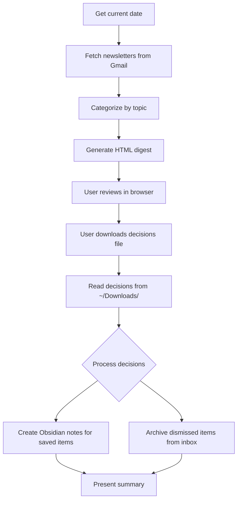

# Newsletter Digest Skill

**Purpose:** One-at-a-time review workflow for product management and AI newsletters. Fetches from Gmail via gog CLI, auto-categorizes by topic, presents interactive browser UI for triage decisions, then executes: save valuable newsletters to Obsidian or archive from inbox.

**Target audience:** Product managers, AI practitioners, and tech professionals who subscribe to newsletters like Lenny's Newsletter, Product Tapas, Nate's Newsletter, and similar product/AI content.

## When to Use This Skill

✅ **Use when:**
- User says "review newsletters", "process newsletters", "newsletter digest", "triage newsletters"
- User wants to decide what to save/archive from their inbox
- User has product/AI newsletters they want to organize
- User mentions specific newsletters (Lenny's, Product Tapas, Nate's, etc.)

❌ **Don't use when:**
- User wants to search for specific newsletter content (use gog CLI directly)
- User wants to bulk archive everything (use gog CLI directly)
- Newsletters are not product/AI focused (categorization won't work well)
- User just wants to read one newsletter (not a batch review workflow)

## Dependencies

**Required:**
1. **gog CLI** - Gmail access
   - Install: `brew install steipete/tap/gogcli`
   - Auth: `gog auth add your@gmail.com --services gmail`

2. **jq** - JSON processing
   - Install: `brew install jq`

**Optional:**
3. **Note storage** - User configures in `newsletter-digest.local.md`:
   - **None**: Saves markdown to `./newsletter-notes/` (default)
   - **Obsidian MCP Server**: Creates notes via MCP tools
   - **Obsidian Filesystem**: Writes to vault folder directly

**First-time setup:**
- Copy `newsletter-digest.local.md.example` to `newsletter-digest.local.md`
- Configure `obsidian_type` and related settings
- Or leave defaults to save locally

## Workflow Overview



## Implementation Steps

### PHASE 1: Get Current Date

**CRITICAL:** Always get the current date first. This ensures accurate timeframe queries.

```bash
CURRENT_DATE=$(date +%Y-%m-%d)
echo "Today is: $CURRENT_DATE"
```

### PHASE 2: Fetch Newsletters

**Mandatory:** Use the provided script. Do NOT improvise with raw gog commands.

```bash
cd skills/newsletter-digest/scripts/
./fetch-newsletters.sh 7d newsletters-raw.json
```

**What this does:**
- Searches inbox for newsletters from last 7 days (configurable)
- Query targets: Substack, Beehiiv, specific senders, Superhuman labels
- Outputs: `newsletters-raw.json` with thread metadata

**Error handling:**
- Script exits 1 if gog fails → Tell user to check `gog auth list`
- Script exits 1 if no results → Confirm timeframe or adjust query
- Script exits 1 if invalid JSON → Check gog CLI version

### PHASE 3: Categorize by Topic

**Mandatory:** Use the categorization script with pattern matching rules.

```bash
./categorize-newsletters.sh newsletters-raw.json newsletters-categorized.json
```

**What this does:**
- Applies rules from `references/category-patterns.md`
- Matches sender email and subject patterns
- Assigns categories: AI Tools & Workflows, AI Strategy, Product & Growth, Leadership & Life, Community & Culture, Uncategorized
- Outputs: `newsletters-categorized.json` with topic field added

**Validation:**
- Check category breakdown in script output
- If too many "Uncategorized", review patterns file
- Spot-check 3-5 assignments for accuracy

### PHASE 4: Generate HTML Digest

**Mandatory:** Use the HTML generation script with template.

```bash
./generate-html.sh newsletters-categorized.json newsletter-digest.html
```

**What this does:**
- Populates `template.html` with newsletter data
- Replaces `{{DATE}}` with current date
- Injects newsletter array as JavaScript
- Outputs: `newsletter-digest.html` ready to open

**Verification:**
- Check file size (should be >50KB for 20+ newsletters)
- Confirm newsletter count in output
- Spot-check HTML has valid JSON in NL array

### PHASE 5: User Review in Browser

**Your role:** Open the HTML file in browser, explain controls, wait for user to finish.

```bash
open newsletter-digest.html
```

**User controls:**
- **S** = Save to Obsidian (for newsletters worth keeping)
- **A** = Archive from inbox (dismiss newsletter)
- **Space/→** = Skip (no action)
- **←** = Go back one newsletter
- Decisions persist in localStorage (survives refresh)

**After review completes:**
User clicks "Save Decisions to File" button → Downloads `newsletter-decisions.md` to `~/Downloads/`

### PHASE 6: Read Decisions File

**Wait for user confirmation** that they've downloaded the decisions file.

```bash
DECISIONS_FILE="$HOME/Downloads/newsletter-decisions.md"

if [[ ! -f "$DECISIONS_FILE" ]]; then
  echo "Decisions file not found. Please download from browser first."
  exit 1
fi

cat "$DECISIONS_FILE"
```

**Parse decisions:**
- "Save to Obsidian" section → Extract threadIds
- "Archive from Inbox" section → Extract gog commands
- Verify format is correct (threadIds are 16-char hex strings)

### PHASE 7: Create Notes for Saved Newsletters

**FIRST: Read configuration from newsletter-digest.local.md**

```bash
CONFIG_FILE="${CLAUDE_PLUGIN_ROOT}/newsletter-digest.local.md"

if [[ -f "$CONFIG_FILE" ]]; then
  # Parse YAML frontmatter
  OBSIDIAN_ENABLED=$(grep "^obsidian_enabled:" "$CONFIG_FILE" | awk '{print $2}')
  OBSIDIAN_TYPE=$(grep "^obsidian_type:" "$CONFIG_FILE" | awk '{print $2}' | tr -d '"')
  OBSIDIAN_MCP_SERVER=$(grep "^obsidian_mcp_server:" "$CONFIG_FILE" | awk '{print $2}' | tr -d '"')
  OUTPUT_DIR=$(grep "^markdown_output_dir:" "$CONFIG_FILE" | awk '{print $2}' | tr -d '"')
else
  # Defaults: no Obsidian, save to local directory
  OBSIDIAN_ENABLED="false"
  OBSIDIAN_TYPE="none"
  OUTPUT_DIR="./newsletter-notes"
fi
```

**For each newsletter marked "Save to Obsidian":**

1. **Fetch full thread content:**
```bash
gog gmail thread get <threadId> --full --no-input > thread-<threadId>.json
```

2. **Extract key information:**
- Title (subject)
- Source (sender name without email)
- Date
- Snippet/preview
- URL to thread

3. **Create markdown note with frontmatter:**
```markdown
---
title: "{{newsletter_title}}"
source: "{{sender_name}}"
date: {{date}}
threadId: {{threadId}}
category: {{topic}}
type: newsletter
tags: [newsletter, {{topic_tag}}]
---

# {{newsletter_title}}

**Source:** {{sender_name}}
**Date:** {{date}}

## Summary

{{snippet}}

## Links

- [View in Gmail](https://mail.google.com/mail/u/0/#inbox/{{threadId}})

---

*Captured by newsletter-digest skill on {{current_date}}*
```

4. **Save based on configuration:**

**Option A: MCP Server (if obsidian_type: "mcp")**
```bash
# Use MCP server tools to create note
# Call appropriate MCP tool based on server capabilities
# Example: obsidian:create-note or similar
```

**Option B: Filesystem (if obsidian_type: "filesystem")**
```bash
VAULT_PATH=$(grep "^obsidian_vault_path:" "$CONFIG_FILE" | cut -d':' -f2- | xargs)
NOTE_FILENAME="Newsletter - $(date +%Y-%m-%d) - {{newsletter_title}}.md"

if [[ -d "$VAULT_PATH" ]]; then
  cp note.md "$VAULT_PATH/$NOTE_FILENAME"
  echo "✓ Saved to Obsidian vault: $VAULT_PATH"
else
  echo "ERROR: Vault not found at $VAULT_PATH"
  exit 1
fi
```

**Option C: Local directory (if obsidian_type: "none" or default)**
```bash
mkdir -p "$OUTPUT_DIR"
NOTE_FILENAME="Newsletter - $(date +%Y-%m-%d) - {{newsletter_title}}.md"
cp note.md "$OUTPUT_DIR/$NOTE_FILENAME"
echo "✓ Saved to: $OUTPUT_DIR/$NOTE_FILENAME"
```

**Configuration guidance:**
- If user hasn't created `newsletter-digest.local.md`, **ask them** how they want to save notes
- If they say "I have Obsidian MCP server", set `obsidian_type: "mcp"` and get server name
- If they say "I don't use Obsidian", set `obsidian_type: "none"` and use local directory
- If they say "I have a vault folder", set `obsidian_type: "filesystem"` and get path

**Grounding requirement:** NEVER hallucinate newsletter content. Only use data from gog CLI responses. Cite threadId for every note created.

### PHASE 8: Archive from Inbox

**For each newsletter marked "Archive from Inbox":**

Run the gog command from decisions file:
```bash
gog gmail thread modify <threadId> --remove INBOX --force
```

**Batch execution:**
- Process all archive commands sequentially
- Log success/failure for each thread
- If any fail, report which threadIds had issues

**Verification:**
Count newsletters in inbox before/after:
```bash
BEFORE=$(gog gmail search 'in:inbox from:substack.com newer_than:7d' --max 100 --json | jq '.threads | length')
# ... run archive commands ...
AFTER=$(gog gmail search 'in:inbox from:substack.com newer_than:7d' --max 100 --json | jq '.threads | length')
echo "Archived: $((BEFORE - AFTER)) newsletters"
```

### PHASE 9: Present Summary

**Report to user:**
```
✓ Newsletter review complete!

Processed: 24 newsletters
  - Saved: 8 notes created
  - Archived from inbox: 12 threads
  - Skipped: 4 threads

Notes saved to: [location based on configuration]
Decisions file: ~/Downloads/newsletter-decisions.md

Next steps:
  - Review saved notes for key insights
  - Newsletter digest HTML saved for future reference
  - Run /newsletter-digest again next week
```

**Location message depends on configuration:**
- Local: `Notes saved to: ./newsletter-notes/`
- MCP: `Notes created via Obsidian MCP server`
- Filesystem: `Notes saved to: ~/path/to/vault/Inbox/`

## Working Files

**Use working files for large batches (>20 newsletters):**

Create: `newsletter-digest-working.md`

Format:
```markdown
# Newsletter Digest - Working File

Date: 2026-02-10
Count: 24 newsletters
Status: In Progress

## Fetched (Phase 2)
✓ 24 threads from last 7 days

## Categorized (Phase 3)
- AI Tools & Workflows: 8
- AI Strategy: 5
- Product & Growth: 5
- Leadership & Life: 3
- Community & Culture: 3

## Generated (Phase 4)
✓ newsletter-digest.html (245KB)

## User Decisions (Phase 6)
- Saved: 8 threads
- Archived: 12 threads
- Skipped: 4 threads

## Obsidian Notes Created (Phase 7)
1. [✓] Newsletter - 2026-02-08 - Getting Paid to Vibe Code
2. [✓] Newsletter - 2026-02-06 - Chrome Auto-Browses
... (list all)

## Archived from Inbox (Phase 8)
1. [✓] threadId: 19c3d73e9865f81e
2. [✓] threadId: 19c32da613895f9b
... (list all)
```

## Error Handling

### gog CLI Not Found
```
Error: gog command not found

Solution:
  brew install steipete/tap/gogcli
  gog auth add your@gmail.com --services gmail
```

### gog Not Authenticated
```
Error: gog auth list failed

Solution:
  gog auth add your@gmail.com --services gmail --force-consent
```

### No Newsletters Found
```
Fetched 0 newsletters from last 7d

Possible causes:
  1. No newsletters in inbox (already processed?)
  2. Timeframe too short (try 14d or 30d)
  3. Query doesn't match your newsletter sources

Check your inbox manually first.
```

### Configuration Not Found
```
No newsletter-digest.local.md found. Using defaults:
  - Notes saved to: ./newsletter-notes/
  - Timeframe: 7 days

To customize:
  1. Copy newsletter-digest.local.md.example to newsletter-digest.local.md
  2. Edit configuration (Obsidian settings, search query, etc.)
  3. Re-run skill
```

### Invalid Decisions File Format
```
Error: Could not parse decisions file

Expected format:
## Save to Obsidian (X)
- **Title** (Source, Date)
  - threadId: `16-char-hex-string`

## Archive from Inbox (Y)
- **Title** (Source, Date)
  - `gog gmail thread modify <threadId> --remove INBOX --force`
```

## Reference Files

### Category Patterns
See: `references/category-patterns.md`

**When to update:**
- New newsletter sources emerge
- Categorization accuracy drops
- User wants different categories

**How to update:**
1. Edit pattern rules in category-patterns.md
2. Re-run categorize-newsletters.sh
3. Spot-check results

### Known Newsletters
See: `references/known-newsletters.md`

**When to update:**
- Subscribe to new newsletters
- Newsletter sender changes email
- Want to customize search query

## Customization

### Adjust Timeframe
Default: 7 days

Change:
```bash
./fetch-newsletters.sh 14d newsletters-raw.json
```

### Customize Search Query
Edit: `scripts/fetch-newsletters.sh`

Line 13:
```bash
QUERY="in:inbox (
  from:YOUR_NEWSLETTER_SOURCE OR
  label:YOUR_LABEL
) newer_than:$TIMEFRAME"
```

### Add Custom Categories
1. Edit `references/category-patterns.md`
2. Add new category section with patterns
3. Re-run categorization

### Change Obsidian Path
Edit PHASE 7 in SKILL.md or create symlink:
```bash
ln -s /your/vault/path ~/Documents/ObsidianVault
```

## Best Practices

1. **Run weekly:** Consistent cadence prevents inbox buildup
2. **Batch review:** Set aside 15-20 minutes for focused triage
3. **Trust your gut:** Skip quickly, save sparingly
4. **Archive aggressively:** If unsure, archive (can always search later)
5. **Review Obsidian notes:** Periodically review saved newsletters for patterns

## Verification Checklist

Before claiming success:
- [ ] Newsletters fetched (count matches inbox)
- [ ] Categories assigned (spot-check 3 random newsletters)
- [ ] HTML opens in browser
- [ ] User completed review
- [ ] Decisions file downloaded
- [ ] Obsidian notes created (verify 2-3 files exist)
- [ ] Inbox count decreased by archived count
- [ ] Summary presented with accurate counts

## Example Session

```
User: /newsletter-digest