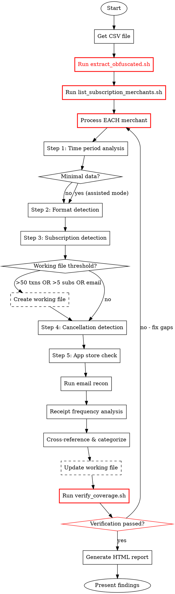

# Subscription Cleanse

Thorough subscription audit using bank CSV + email reconnaissance to help users decide what to cancel.

## Overview

Identify ALL subscriptions from multiple sources and present comprehensive findings for user evaluation.

**Philosophy: Awareness first, action second (or never)**

- Get to the list as quickly and thoroughly as possible
- Do NOT interrupt with AskUserQuestion prompts unless user explicitly requests interaction or is clearly stuck
- Present findings comprehensively, let user decide what to do
- Action (canceling, negotiating) happens outside this skill or not at all

**Primary goal:** Surface all subscriptions with grounded data for user awareness
**Secondary:** Note negotiation opportunities and cancel URLs for reference

## When to Use

**Use this skill when:**
- User asks to audit/review subscriptions
- Find recurring charges or "what am I paying for"
- Reduce monthly expenses
- Cleanse unused subscriptions

**Skip for:**
- Single known subscription ("cancel my Netflix")
- Just negotiating a specific bill

## Dependencies

**Required:**
- Bank CSV export (user provides)

**Optional but recommended:**
- Gmail access via MCP server (e.g., GSuite-Enhanced MCP) for email reconnaissance
- If no email MCP available, skill works with CSV-only analysis (reduced detection)

## First Step: Establish Current Date

**Before any analysis, get and record today's date.** This is critical for:
- Calculating "days since last charge"
- Determining if subscriptions are cancelled (missed expected charges)
- Email search timeframes (`newer_than:12m` needs reference point)
- Working file timestamps

**Get the date reliably** (in order of preference):
```bash
# Most reliable - works everywhere
date "+%Y-%m-%d"

# Or with more detail
date "+%Y-%m-%d %H:%M %Z"
```

Record it explicitly at the start of analysis and in working file:
```
Analysis date: 2025-01-07
```

**Do NOT assume or hallucinate the date.** Claude's training data often defaults to outdated years. Always verify with an actual system call.

## MANDATORY: Script-Driven Extraction (Cannot Skip)

**This step uses helper scripts to ensure complete extraction. Do not improvise.**

### Locate Scripts

The helper scripts are in this skill's directory. Find them first:

```bash
# Find the skill directory (scripts are in skills/subscription-cleanse/scripts/)
SKILL_DIR=$(find ~/.claude ~/.config/claude-code ~/dev -name "subscription-cleanse" -type d 2>/dev/null | grep -E "skills/subscription-cleanse$" | head -1)
SCRIPTS="$SKILL_DIR/scripts"

# Verify scripts exist
ls "$SCRIPTS"/*.sh
```

If you cannot find the scripts directory, check:
- `~/.claude/plugins/*/skills/subscription-cleanse/scripts/`
- `~/.config/claude-code/plugins/*/skills/subscription-cleanse/scripts/`
- The user's local clone of the plugin repository

### Step 1: Run Extraction Script

```bash
# Run IMMEDIATELY after loading CSV - produces structured output
"$SCRIPTS/extract_obfuscated.sh" [csv_file] extracted_merchants.json
```

This script:
- Extracts ALL Privacy.com, PayPal, Square, Google, Apple merchants
- Filters known non-subscription merchants
- Outputs structured JSON for validation
- Prints summary of merchants to process

**Do not substitute with manual grep commands.** The script ensures consistency.

### Step 2: Generate Subscription Checklist

```bash
# Creates a checklist of subscription-like merchants
"$SCRIPTS/list_subscription_merchants.sh" [csv_file]
```

**Copy the output checklist into your working file.** Process each item:

```markdown
## Obfuscated Merchant Processing

| # | Merchant (truncated) | Charges | Identified As | Amount | Status |
|---|---------------------|---------|---------------|--------|--------|
| 1 | CLAUDE.AI S | 10 | Claude (Anthropic) | $110-220/mo | [x] DONE |
| 2 | BACKBLAZE I | 1 | Backblaze | $198/yr | [x] DONE |
| 3 | LENNYS NEWS | 1 | Lenny's Newsletter | $350/yr | [x] DONE |
| ... | ... | ... | ... | ... | ... |
```

### Step 3: Identify Each Merchant

For EACH merchant in the checklist:

1. **Check mapping** - [privacy-com-parsing.md](references/privacy-com-parsing.md)
2. **Use reasoning** - What service matches this truncated name + amount?
3. **Disambiguate** - For multi-product vendors (Google, Apple), use amount
4. **Web search** - If uncertain and tools available
5. **Flag unknown** - Mark as "NEEDS VERIFICATION" for user

**Include single charges.** Annual subscriptions appear once per year.

### Step 4: Verify Before Report

```bash
# Run BEFORE generating final report - blocks if merchants missing
"$SCRIPTS/verify_coverage.sh" extracted_merchants.json subscription-audit-YYYY-MM-DD.md
```

**If verification fails:** Go back and identify the missing merchants.

### Why Scripts?

A previous run missed 18 subscriptions ($1,800+/year) because Claude:
1. ✓ Extracted merchants correctly
2. ✗ Then searched for known names instead of processing the extracted list
3. ✗ Skipped single-charge annual subscriptions

Scripts enforce the checklist workflow and block report generation until all merchants are processed.

## Working File (Context Persistence)

To maintain grounding across compactions, create a working audit file when thresholds are met.

**Create working file when ANY of:**
- CSV contains >50 transactions
- >5 subscriptions detected
- Email reconnaissance is enabled

**Retroactive creation:** If user asks a follow-up question about specific amounts and no working file exists, create one from current context before answering (may have reduced detail if context was compacted).

**File:** `./subscription-audit-YYYY-MM-DD.md` (in current working directory)

**Structure:**
```markdown
# Subscription Audit - Working File
Generated: YYYY-MM-DD HH:MM | CSV: [filename]

## Data Coverage
Period: [start] to [end] ([X] days) | Mode: [Full/Minimal]
Transactions: [count] | Working file reason: [threshold met]

## Detected Subscriptions
| # | Service | Amount | Conf | Source | Freq | Status |
|---|---------|--------|------|--------|------|--------|
| 1 | Netflix | $15.99 | [CSV] | Rows 12,28,44 | Monthly | Active |

## Email Receipt Counts (if applicable)
| Service | Found | Expected | Last Receipt | Assessment |
|---------|-------|----------|--------------|------------|

## Categorization
Status: [pending/confirmed]
- Cancel: [list]
- Investigate: [list]
- Keep: [list]

## Audit Log
- [timestamp] Created working file
- [timestamp] Phase 2 complete: [X] subscriptions detected
- [timestamp] User confirmed categorization
```

**Usage rules:**
1. **Append, don't replace** - Add timestamped entries to Audit Log
2. **Re-read before answering specifics** - If user asks about a specific amount/service, re-read working file first
3. **Cite the file** - "Per audit file, Gabb is $40-49/mo (rows 8,24,40)"
4. **Single source of truth** - Final HTML report generated FROM working file

**If working file cannot be created** (permissions, invalid path): Warn user about reduced context persistence and continue with in-memory analysis. Note limitation in final report.

## Category Definitions

| Category | Description | User Action |
|----------|-------------|-------------|
| **Cancel** | Clear waste - unused, forgotten, duplicate | Cancel immediately |
| **Investigate** | Active but value unclear - needs decision | User decides: cancel or keep |
| **Keep** | Intentional, actively used | No action (note if negotiable) |

## Grounding Requirements

These requirements prevent hallucination and ensure accuracy. They are non-negotiable.

### Price Verification

**NEVER state a price without source citation.** This is the #1 cause of analyst error.

| Source Type | Citation Format | Example |
|-------------|-----------------|---------|
| CSV (single) | `(Row N: $X.XX)` | Netflix: $15.99/mo (Row 47: $15.99) |
| CSV (multiple) | `(Rows N,N,N: $X, $Y, $Z)` | Gabb: $40-49/mo (Rows 8,24,40: $40.00, $47.23, $49.36) |
| Email | `(Email [date]: "$X.XX")` | Spotify: $10.99/mo (Email Dec 15: "$10.99") |
| Unknown | State explicitly | Headspace: amount unknown - verify manually |

**If you cannot cite a source, do not state the price.**

### Source Tagging

Tag EVERY finding with its data source (not status confidence - those are separate):

| Tag | Meaning | When to Use |
|-----|---------|-------------|
| `[CSV]` | Amount from bank transaction | Have CSV row with date and amount |
| `[CSV-PRIVACY]` | Privacy.com virtual card | Merchant name may be truncated |
| `[EMAIL]` | Amount from email receipt | Email contains explicit price quote |
| `[INFERRED]` | No direct amount found | Merchant name match, pattern only |

**Important:** Source tag ≠ status confidence. A service can be `[EMAIL]` (confirmed source) but have uncertain status (1/12 receipts).

**Privacy.com note:** `[CSV-PRIVACY]` indicates merchant name was extracted from truncated Privacy.com format. Cross-reference with email if service name is unclear.

**Output format:**
```
1. **Netflix** [CSV] - $15.99/mo (Rows 12,28,44)
2. **Spotify** [EMAIL] - $10.99/mo (Email Dec 15: "$10.99")
3. **Possible AWS** [INFERRED] - amount varies (merchant pattern match)
```

**Rule:** `[INFERRED]` items should default to "Investigate" category unless user confirms.

## Workflow



### Phase 1: Data Collection

**Request bank CSV export:**
- Apple Card: Wallet app → Card Balance → Export
- Chase: Accounts → Download activity → CSV
- Mint: Transactions → Export

Ask user to provide the CSV file path.

**Confirm email access:**
- Verify GSuite-Enhanced MCP is available (provides Gmail API access via MCP protocol)
- Alternative: Any MCP server with Gmail query capability, or manual email search
- Confirm user email account to search

### Phase 2: CSV Analysis

**IMPORTANT:** Follow structured CSV parsing - don't guess formats randomly.

Reference: [csv-parsing.md](references/csv-parsing.md) for complete parsing guide (CSV, OFX, QIF, Plaid JSON)

#### Step 1: Time Period Analysis

Before analyzing transactions, establish the data boundaries:

```python
# Calculate coverage
earliest_date = min(all_transaction_dates)
latest_date = max(all_transaction_dates)
coverage_days = (latest_date - earliest_date).days
coverage_months = coverage_days / 30
```

**Report to user:**
- "CSV covers: {earliest_date} to {latest_date} ({coverage_months} months)"

**Data coverage determines analysis mode:**

| Coverage | Mode | What Changes |
|----------|------|--------------|
| **12+ months** | Full Analysis | All detection strategies available |
| **3-12 months** | Standard Analysis | Pattern detection works; annual detection relies on known-services list |
| **< 2 months** | Minimal Data Mode | See special handling below |

##### Minimal Data Mode (< 2 months coverage)

**Tell user:** "With less than 2 months of data, pattern detection isn't reliable. Switching to assisted mode - I'll flag potential subscriptions for your review."

**What changes:**
1. **Skip interval-based pattern detection** - not enough data points
2. **Flag ALL charges from known subscription merchants** - use common-services.md + annual-services.md
3. **Lean heavily on email reconnaissance** - email provides the history CSV lacks
4. **Present all flagged charges to user** - ask them to confirm which are recurring
5. **Be explicit about uncertainty** - "This MIGHT be a subscription based on merchant name"

**This isn't worse, just different** - email recon often catches more than CSV pattern detection anyway.

#### Step 2: Format Detection & Parsing

**Format Detection (in order):**
1. Read headers and first 5 data rows
2. Identify columns using signatures:
   - **Apple Card**: Has "Merchant" AND "Clearing Date" columns
   - **Chase**: Has "Post Date" AND "Type" columns
   - **Mint**: Has "Original Description" column
   - **Capital One**: Dates in YYYY-MM-DD format
   - **Discover**: Has "Trans. Date" (with period)
   - **OFX/QFX**: XML with `<STMTTRN>` tags
   - **QIF**: Lines starting with `!Type:` and field codes (D, T, N, M)
   - **Generic**: Match by column name patterns (date, amount, description)
3. Determine amount sign convention (negative = charge vs positive = charge)
4. Detect date format from first date value

**Large File Handling:**
- Files >10MB or >50k rows: Use chunked processing (1000 rows at a time)
- Files >100MB: Sample first 5000 + last 1000 rows for analysis

**Merchant Normalization:**
Apply these patterns before grouping:
- `SPOTIFY USA 123456` → `SPOTIFY` (remove country codes, reference numbers)
- `GOOGLE *YOUTUBE` → `YOUTUBE` (split on *, take second part)
- `AMZN MKTP US*ABC` → `AMAZON` (standardize Amazon)
- `PAYPAL *SERVICE` → `SERVICE` (PayPal pattern)
- `PP*SERVICE` → `SERVICE` (alternate PayPal pattern)
- Remove: .com/.net, trailing numbers, country codes

**Privacy.com Virtual Cards:**
Reference: [privacy-com-parsing.md](references/privacy-com-parsing.md)

Privacy.com truncates merchant names to ~12-14 characters:
- Pattern: `PwP {MERCHANT}Privacycom{YYMMDD}TN: {ID}WEB`
- Extract: `PwP CLAUDE.AI SPrivacycom...` → `CLAUDE.AI S` → `CLAUDE AI`
- Check truncation mapping table for full service name
- Tag as `[CSV-PRIVACY]` to note potential truncation uncertainty

Common truncations: `CURSOR USAG` → Cursor, `BACKBLAZE I` → Backblaze, `LinkedInPre` → LinkedIn Premium

See csv-parsing.md for complete normalization algorithm.

#### Step 3: Subscription Detection (Unified Strategy)

Detection uses THREE complementary approaches:

**Approach 0: Obfuscated Transaction Analysis**

Reference: [obfuscated-transactions.md](references/obfuscated-transactions.md)

If obfuscated transactions were detected, their merchants have already been extracted. Now identify each one.

**Identification hierarchy:**

1. **Known mapping** (fast path) - check reference files for exact/partial match
2. **Reasoning** - use world knowledge to identify from partial name + amount
3. **Disambiguation** - use amount to distinguish multi-product vendors (Google, Apple, etc.)
4. **Web search** - if uncertain and tools available
5. **User verification** - flag unknowns for user to identify

**Examples of reasoning:**
- `BACKBLAZE I` → Backblaze (cloud backup), ~$99/yr
- `PAYPAL *SPOTIFY` → Spotify (streaming), ~$11-17/mo
- `GOOGLE *Goo` + $219 → Google One (storage), annual plan

**Output with source tags:**
```
- Spotify [CSV-PAYPAL] - $13.13/mo
- Backblaze [CSV-PRIVACY/inferred] - $198/yr - cloud backup
- Google One [CSV-PRIVACY/disambiguated] - $219.49 - 2TB annual
- INNOVATION [CSV-PRIVACY/unknown] - $100 × 10 - NEEDS VERIFICATION
```

**Include single charges.** Annual subscriptions appear once. Don't filter by charge count.

---

**Approach A: Pattern Detection (merchants with 2+ charges)**
1. Group transactions by normalized merchant name
2. Sort dates per merchant, calculate intervals
3. Frequency detection (expanded ranges for calendar-date billing):
   - Monthly: 27-34 days between charges
   - Bi-monthly: 55-65 days between charges
   - Quarterly: 85-100 days between charges
   - Semi-annual: 175-195 days between charges
   - Annual: 350-380 days between charges
4. Calculate: frequency, average amount, total annual cost

**Approach B: Known-Service Detection (merchants with 1 charge)**
Reference: [annual-services.md](references/annual-services.md) + [common-services.md](references/common-services.md)

1. Check merchant name against known subscription services
2. Flag ANY single charge from: Backblaze, YNAB, Google One, Amazon Prime, domain registrars, etc.
3. For unknown merchants with $30-$500 charges, flag as "Possible subscription - verify with user"

**Example catches from Approach B:**
- Single $99 charge from BACKBLAZE = Annual backup subscription
- Single $139 charge from AMAZON PRIME = Annual Prime membership
- Single $99 charge from YNAB = You Need A Budget annual

**Variable Amount Handling:**

Don't require consistent amounts. Many legitimate subscriptions have variable charges:
- Usage-based (AWS, Twilio, cloud services) - highly variable
- Currency conversion - minor variance
- Plan changes mid-cycle - one-time variance
- Family plan member changes - step changes

```python
# Instead of filtering by amount variance, flag it as metadata
if amount_variance > 0.20:  # >20% variance
    subscription.note = "Variable amount - likely usage-based billing"
    subscription.is_subscription = True  # Still a subscription!
```

**For known subscription merchants (Netflix, Spotify, etc.): ALWAYS flag as subscription regardless of amount patterns.**

#### Step 4: Cancellation Detection

Compare recent activity to historical patterns to identify likely-cancelled subscriptions:

```python
# For each recurring merchant with detected frequency
last_charge_date = max(merchant_dates)
expected_interval = detected_frequency_days  # 30 for monthly, 365 for annual

# Guard: Skip if no frequency detected (single charge, unknown pattern)
if expected_interval is None or expected_interval <= 0:
    continue  # Can't detect cancellation without known frequency

days_since_last = (today - last_charge_date).days
expected_charges_missed = days_since_last / expected_interval

if expected_charges_missed >= 2:
    status = "Likely Cancelled"
elif expected_charges_missed >= 1.5:
    status = "Possibly Cancelled"
else:
    status = "Active"
```

**Present to user:**
```
## Likely Cancelled (verify these are intentional)
- Netflix: Last charge Oct 15, expected monthly - 3 charges missed
- Headspace: Last charge Sep 1, expected monthly - 4 charges missed
```

**Why this matters:**
- Confirms user actually cancelled what they intended
- Catches subscriptions that stopped (maybe card expired?)
- Identifies services that may have failed to renew

#### Step 5: App Store Subscription Check

**IMPORTANT:** App store charges bundle multiple subscriptions into single line items.

If you see these merchants, alert the user:
- `APPLE.COM/BILL` or `APL*APPLE` - iOS App Store subscriptions
- `GOOGLE *PLAY` or `GOOGLE PLAY` - Android Play Store subscriptions

**Tell user:**
```
Found bundled app store charges that may contain multiple subscriptions:
- APPLE.COM/BILL: $47.94 on Jan 5 (may be 3-5 individual app subscriptions)

I cannot unbundle these from bank data. Please check:
- iOS: Settings → [Your Name] → Subscriptions
- Android: Play Store → Payments & subscriptions → Subscriptions

Add any app subscriptions you find to our list for the final report.
```

**Match to known services:**
Reference: [common-services.md](references/common-services.md)
- Map merchant names to service names
- Extract cancel URLs

### Phase 3: Email Reconnaissance

Use GSuite-Enhanced MCP to search for subscription signals.

Reference: [email-patterns.md](references/email-patterns.md)

**Run in order:**

1. **Receipt/invoice search** (Tier 1):
```
subject:(receipt OR invoice) newer_than:12m
subject:"payment received" newer_than:12m
```

2. **Trial/warning search** (Tier 2):
```
subject:("trial ending" OR "trial expires") newer_than:6m
"your card will be charged" newer_than:6m
```

3. **Merchant-specific** (for each CSV merchant):
```
from:@merchantdomain.com newer_than:12m
```

**Extract from emails:**
- Service name confirmation
- Last activity date
- Plan tier
- Price changes

#### Email Receipt Frequency Analysis

For services detected via email receipts (especially Apple/Google bundled billing), count receipts to determine status.

**Methodology:**
1. For each service with email receipts, count total receipts found
2. Calculate expected receipts based on billing frequency and analysis period
3. Compare found vs expected to assess status

| Found vs Expected | Assessment | Action |
|-------------------|------------|--------|
| 12/12 monthly receipts | Definitely active | Tag [EMAIL], include in findings |
| 6/12 then stopped | Likely cancelled | Note last receipt date, verify with user |
| 1/12 expected | One-time OR cancelled after | Flag as uncertain, ask user |

**Present comparison explicitly:**
```
Apple subscriptions (via email receipts, 12-month analysis):
- iCloud+ 2TB [EMAIL]: 12/12 receipts (last: Dec 25) → Active
- Apple TV+ [EMAIL]: 10/12 receipts (last: Oct 24) → Possibly cancelled
- Meet Mobile [EMAIL]: 1/12 receipts (Jul only) → Status uncertain (cancelled or one-time?)
```

Note: Meet Mobile is `[EMAIL]` (source confirmed via receipt) but status is uncertain due to missing expected receipts.

**Why this matters:**
- Single receipt ≠ active subscription (the Gabb/$24.99 error pattern)
- Receipt gaps reveal cancellations email-only analysis might miss
- Makes reasoning explicit and auditable

### Phase 4: Cross-Reference & Categorize

Combine CSV + email findings into unified list.

#### Email-Only Subscriptions (No Matching Transaction)

**IMPORTANT:** Subscriptions found in email but NOT in bank CSV require investigation.

**Detection:** After email recon, compare email-discovered services against CSV merchants:
```python
email_services = set(services_from_email_receipts)
csv_merchants = set(normalized_merchants_from_csv)
email_only = email_services - csv_merchants
```

**Present to user:**
```
## Found in Email, Not in Bank Statement ({{COUNT}})

These services sent receipts/invoices but no matching charge appears:

1. **Notion** - Receipt emails found, no bank charge
   Possible reasons: Different card? Business expense? Free tier?

2. **Canva** - "Payment received" email Dec 15
   Possible reasons: Charged to PayPal? Different account?

3. **Grammarly** - Trial ending email, no charge yet
   Action: Trial may auto-convert - decide now
```

**Common explanations:**
| Reason | Action |
|--------|--------|
| Different credit card | Ask user to export that card too |
| Business expense (company card) | Note as business, may need for taxes |
| PayPal/Venmo payment | Check those accounts separately |
| Free tier | No action, but note in case of future conversion |
| Family plan (someone else pays) | Note, user may not control cancellation |
| Gift subscription | Check expiration date in email |
| Refunded/disputed | Verify it's actually cancelled |

**Why this matters:**
- Catches subscriptions across multiple payment methods
- Identifies trials about to convert
- Reveals business expenses mixed with personal

**Cancel signals:**
- No email activity in 90+ days
- Price increased since signup
- Duplicate service (two streaming, two music)
- Trial auto-converted without explicit action
- Service deprecated/sunset

**Investigate signals:**
- Active charges but unclear value
- Shared/family plan (not sole decision-maker)
- Business expense (may need for taxes)
- Email activity but no clear usage pattern

**Keep signals:**
- Recent activity emails (watched, listened, used)
- Critical service (password manager, cloud storage with data)
- User explicitly values

### Phase 5: Present Findings

**Do NOT wait for user confirmation.** Present all findings and generate report immediately.

```markdown
## Summary

Found **{{TOTAL}}** subscriptions totaling **${{MONTHLY}}/mo** (${{ANNUAL}}/yr)

## Suggested: Cancel ({{COUNT}}) - ${{AMOUNT}}/mo potential savings

1. **Netflix** [CSV] - $15.99/mo (Rows 12,28,44)
   Last charge: Jan 5 | No activity emails in 120 days

2. **Headspace** [CSV] - $12.99/mo (Row 67)
   Last charge: Jan 1 | Last use email: Oct 2024

## Suggested: Investigate ({{COUNT}}) - ${{AMOUNT}}/mo

3. **Spotify Family** [CSV] - $16.99/mo (Rows 8,24,40)
   Shared plan - you may not be decision-maker

## Likely Keep ({{COUNT}}) - ${{AMOUNT}}/mo

4. **1Password** [CSV] - $4.99/mo (Row 91)
   Active use, critical service
```

Categorizations are suggestions based on signals detected. User reviews the list and decides - no confirmation step required.

### Phase 6: Generate Report

Use template: [template.html](scripts/template.html)

**Populate:**
- Summary statistics (total, by category)
- Potential savings (Cancel + Investigate totals)
- Each subscription with:
  - Name, amount, frequency
  - Last charge date, source
  - Reason for category
  - Cancel URL (if available)
  - Negotiation note (if applicable, for Keep items only)

**Save to:** `./subscription-cleanse-YYYY-MM-DD.html` (in current working directory)

## Negotiation Notes

For items in **Keep** category only, check if negotiable.

Reference: [negotiable-services.md](references/negotiable-services.md)

**Negotiable (note in report):**
- Internet: Xfinity, AT&T, Spectrum, Cox
- Cable: DirecTV, Dish
- Mobile: AT&T, Verizon, T-Mobile

**Not negotiable (suggest alternatives):**
- Streaming: Annual billing, student discounts
- Software: Annual plans, family splits
- Apps: Free tiers, downgrades

Example note in report:
```
Xfinity Internet - $89.99/mo
Negotiable: Call retention (1-800-XFINITY) or use BillShark.
Typical savings: $200-400/year.
```

## Output Format

Present summary in chat:

```markdown
# Subscription Cleanse Complete

**Found:** {{TOTAL_COUNT}} subscriptions totaling ${{TOTAL_MONTHLY}}/mo (${{TOTAL_ANNUAL}}/yr)

**Recommended Actions:**
- Cancel {{CANCEL_COUNT}} items: ${{CANCEL_MONTHLY}}/mo savings
- Review {{INVESTIGATE_COUNT}} items: ${{INVESTIGATE_MONTHLY}}/mo potential
- Keep {{KEEP_COUNT}} items: ${{KEEP_MONTHLY}}/mo

**Negotiation opportunities:** {{NEGOTIATE_COUNT}} services (see report)

Full report saved: ./subscription-cleanse-YYYY-MM-DD.html
```

## Quick Reference: Parsing

**Supported Formats:**
- CSV (all major banks)
- OFX/QFX (Quicken, most bank exports)
- QIF (legacy Quicken)
- Plaid JSON (fintech apps)

**Full parsing guide:** [csv-parsing.md](references/csv-parsing.md)

**Format Detection Signatures:**
```python
# CSV Banks:
# Apple Card: "Merchant" + "Clearing Date"
# Chase: "Post Date" + "Type"
# Mint: "Original Description"
# Capital One: YYYY-MM-DD dates
# Discover: "Trans. Date" (period in name)
# Bank of America: "Payee"
# Wells Fargo: Simple Date/Amount/Description
# AmEx: "Card Member"

# Other Formats:
# OFX/QFX: Starts with "OFXHEADER" or "<OFX>"
# QIF: Starts with "!Type:"
# Plaid JSON: Has "transaction_id" and "merchant_name" fields
```

**Merchant Normalization:**
- `GOOGLE *SERVICE` → `SERVICE`
- `PAYPAL *NAME` or `PP*NAME` → `NAME`
- `AMZN MKTP` → `AMAZON`
- `APL*APPLE.COM/BILL` → `APPLE`
- Remove: .com, USA, trailing numbers

**Frequency Detection (calendar-aware):**
- Monthly: 27-34 days
- Bi-monthly: 55-65 days
- Quarterly: 85-100 days
- Semi-annual: 175-195 days
- Annual: 350-380 days

**Large File Handling:**
- >10MB: Process in 1000-row chunks
- >100MB: Sample first 5k + last 1k rows

## Common Mistakes

| Mistake | Fix |
|---------|-----|
| **Stating price without source** | ALWAYS cite: (Row 47: $15.99) or (Email Dec 15: "$10.99") |
| **Treating 1 email receipt as "active"** | Count receipts vs expected; 1/12 = uncertain, not confirmed |
| **Mixing confidence without tagging** | Tag every finding: [CSV], [EMAIL], or [INFERRED] |
| **Losing context across compaction** | Create working file if >50 txns, >5 subs, or email enabled |
| **Skipping obfuscated transaction extraction** | Scan for Privacy.com/PayPal/etc FIRST; extract real merchants before pattern detection |
| **Only using mapping tables** | Mappings accelerate but can't cover all services; use reasoning for unknowns |
| **Filtering by charge count** | Annual subs appear once - Backblaze, YNAB, Costco are single charges; include ALL |
| **Not disambiguating by amount** | GOOGLE *Goo could be One, Workspace, Fi - use amount to determine which |
| Missing annual subscriptions | Check known-annual services list; don't require 2+ charges |
| Only looking for patterns | Single charges from YNAB, Backblaze, etc. ARE subscriptions |
| Not analyzing time period | Report CSV date range; warn if < 12 months |
| Missing cancelled subscriptions | Compare recent months to history; flag stopped charges |
| Not checking email | CSV misses context, email adds activity signals |
| Ignoring email-only findings | Services in email but not CSV = different card or free tier |
| Categorizing shared plans as Cancel | Ask user - they may not be decision-maker |
| Including one-time purchases | Filter for recurring patterns only |
| Missing app store subscriptions | Check Apple/Google billing separately |

## Privacy

- CSV analysis happens locally
- Email searches use user's authenticated MCP connection
- HTML report saved locally
- No subscription data sent to external services
